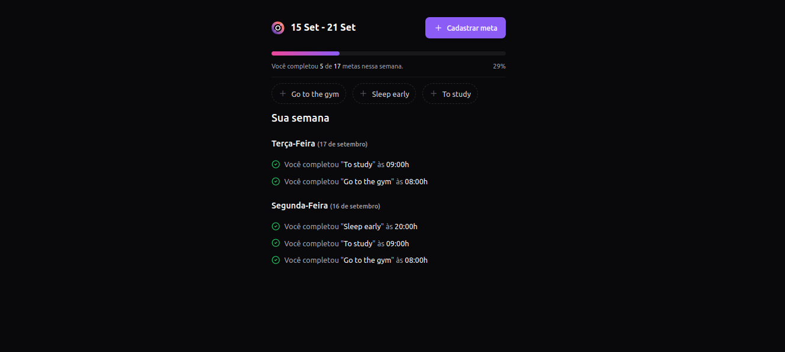
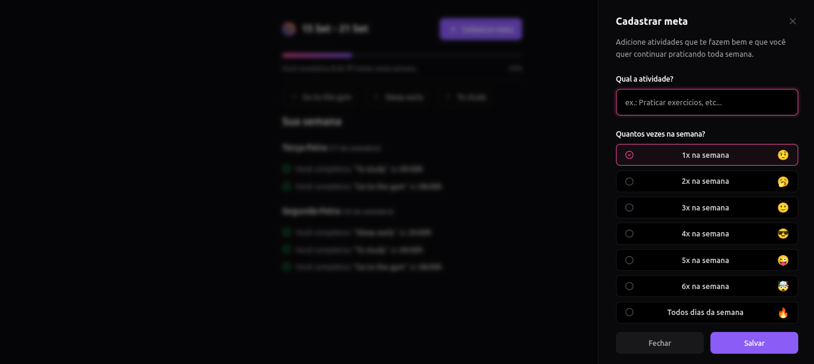

# in-orbit

[](https://react.dev/)
[](https://vitejs.dev/)
[](https://www.typescriptlang.org/)
[](https://zod.dev/)
[](https://react-hook-form.com/)
[](https://www.radix-ui.com/)
[](https://tanstack.com/query/latest)
[](https://tailwindcss.com/)

### summary

- [About](#about-the-project)
- [Install dependencies](#install-dependencies)
- [Run project](#run-project)

---

### About the project:
In Orbit is a habit tracker where you can create and monitor the progress of new habits throughout the week. Users can create and define how many times they want to perform a habit, and can also mark it as completed.




### Install dependencies
```bash
npm install
```

### Run project
```bash
npm run dev
```
